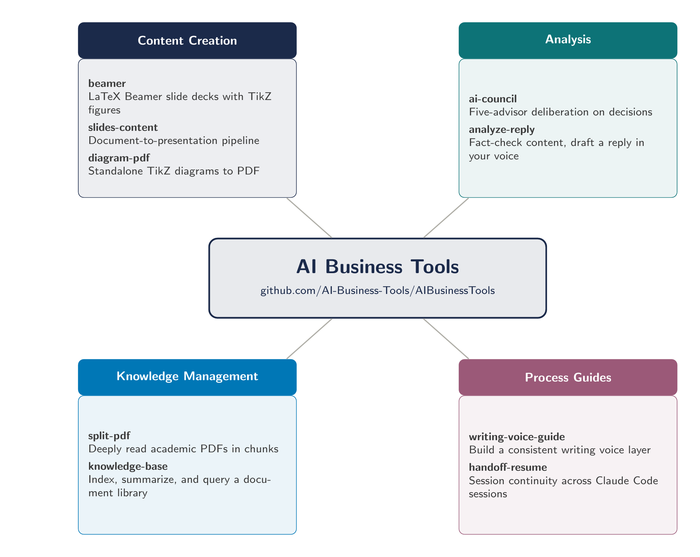

# Skills Thematic Diagram

A sample output of the [diagram-pdf](../../skills/diagram-pdf/) skill, used to visualize this repository's own skills catalog as a thematic diagram.

## The Example



- Source: [example.pdf](example.pdf) (the original TikZ-generated PDF)
- Raster: [example.png](example.png) (300 DPI, suitable for embedding in posts or slides)
- TikZ source: [skills-thematic-diagram_build/diagram.tex](skills-thematic-diagram_build/diagram.tex)

## Layout

- **Hub-and-spoke thematic layout** with a central hub node and four category clusters arranged at the corners.
- **Central hub** carries the repo identity (name and GitHub URL) and serves as the diagram's visual anchor.
- **Four clusters of equal height** at the corners, connected to the hub by plain spoke lines. Each cluster has a colored header (category name) and a light-fill body (bullet list of skills).
- **Cluster colors** drawn from the diagram style guide's semantic palette: SlateNavy, DeepTeal, CyanBlue, DustyPlum.
- **No legend**: cluster headers are self-labeling, so a legend would repeat information already visible.

## How It Was Generated

1. The user described the clusters (category name, color, and a list of skills with one-line descriptions) as free text to the `diagram-pdf` skill.
2. The skill chose the thematic layout based on the structure.
3. The skill compiled `diagram.tex` with `pdflatex`, ran an independent audit agent, applied the audit's fixes, and re-audited until clean.
4. A final pass converted the PDF to PNG at 300 DPI using `pdftoppm`.

## Editing

Open `skills-thematic-diagram_build/diagram.tex` and recompile with:

```bash
pdflatex -interaction=nonstopmode diagram.tex
```

For the PNG:

```bash
pdftoppm -r 300 -png diagram.pdf example && mv example-1.png ../example.png
```
